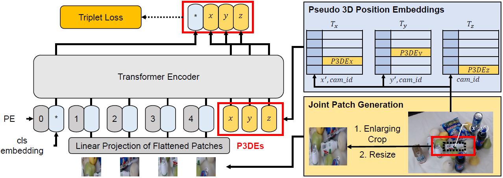

# ViT-P3DE\*: Vision Transformer Based Multi-Camera Instance Association with Pseudo 3D Position Embeddings

This repository contains the code of our **IJCAI 2023** paper (To be appear in IJCAI 2023).
>"ViT-P3DE\*: Vision Transformer Based Multi-Camera Instance Association with Pseudo 3D Position Embeddings
>
>Minseok Seo, Hyuk-Jae Lee, Xuan Truong Nguyen.
>
>IJCAI 2023



Some of our codes are based on the following repositories: [MessyTable](https://github.com/caizhongang/MessyTable), [DeiT](https://github.com/facebookresearch/deit), and [TransReID](https://github.com/damo-cv/TransReID).

We'd like to thank the authors providing the codes.

Since this repository is managed/verified by myself, there may be some parts not fully checked in detail when re-organizing the codes for publication.
Let me know if there are any problems.

## 0. Citation (To be appear)
```
```

## 1. Setup
### Requirements
This codes are tested under PyTorch v1.8 and torchvision v0.9 with a single NVIDIA A100 GPU (Ubuntu 18.04, NVIDIA-driver v510.47, CUDA v11.1).

Python 3.7 is needed to use the KMSolver module provided in "src" folder.

### Installation
#### 1) Clone repository
~~~bash
https://github.com/La-tale/ViT-P3DE.git
~~~
#### 2) Setup dependencies
~~~bash
conda create -n vit_p3de python=3.7
conda activate vit_p3de
conda install pytorch==1.8.0 torchvision==0.9.0 torchaudio==0.8.0 cudatoolkit=11.1 -c pytorch -c conda-forge
pip install opencv-python==3.4.2.17
pip install scipy==1.2.0
pip install sklearn==0.0
pip install timm==0.5.4
pip install PyYAML==5.4.1
~~~

### Dataset preparation
We cite the dataset preparation guideline from [MessyTable](https://github.com/caizhongang/MessyTable).

Please see the [MessyTable](https://github.com/caizhongang/MessyTable) website instructions or below.

The project homepage of MessyTabe is in [MessyTable](https://github.com/caizhongang/MessyTable).
* Download MessyTable.zip (~22 GB) from [[Aliyun]](https://openmmlab.oss-cn-hangzhou.aliyuncs.com/datasets/MessyTable.zip) or [[Google Drive]](https://drive.google.com/file/d/1i4mJz9xsDwhzWes7sVLXuhLKP9eNtbBG/view?usp=sharing)
* Unzip MessyTable.zip, check the unzipped folder includes `images/` and `labels/`
* Rename the unzipped folder to `data/`, place `data/` in this repository as follows:

```bash
ViT-P3DE
├──data
   ├── images
   └── labels
``` 
### Download pre-trained models
Download the pretrained model from this [link](https://drive.google.com/drive/folders/1l0ArZdmNYBrvKhNanVRkdse0so_yU0kL?usp=sharing). 

- TripletNet.pth : ViT-baseline framework with ViT-Tiny
- TripletNet_cam_pos.pth : ViT-P3DE\* framework with ViT-Tiny

This table presents quantitative results of proposed works evaluated on MessyTable

| Framework | Backbone    | Param. | AP ↑ | FPR-95 ↓ | IPAA-100 ↑ |
|-----------|-------------|--------|------|----------|------------|
| ViT-baseline | ViT-T       | 6M   | 70.5 | 7.9  | 27.9 |
|           | ViT-S       | 22M  | 73.3 | 6.8  | 29.7 |
|           | ViT-B       | 87M  | 74.7 | 6.3  | 32.1 |
|           | DeiT-T      | 6M   | 71.7 | 7.3  | 28.8 |
|           | DeiT-S      | 22M  | 73.8 | 6.5  | 29.2 |
|           | DeiT-B      | 87M  | 75.2 | 6.1  | 32.7 |
| ViT-P3DE\*  | ViT-T       | 6M   | 82.8 | 4.9  | 43.5 |
|           | ViT-S       | 22M  | 85.1 | 4.2  | 46.2 |
|           | ViT-B       | 87M  | 86.6 | 3.6  | 48.3 |
|           | DeiT-T      | 6M   | 82.6 | 5.0  | 43.4 |
|           | DeiT-S      | 23M  | 85.3 | 4.0  | 47.1 |
|           | DeiT-B      | 87M  | 87.4 | 3.4  | 49.2 |


## 2. Training
Run the command below to train the framework. For more options, please refer to `src/train.py`

Default configuration is training on 1 GPUs with one batch size (64 triplet pairs)

Example for ViT-P3DE\*
~~~bash
python3 src/train.py --config_dir tripletnet_1gpu_all_pairs_vit_tiny_p3de
~~~

Arguments:
* --config_dir: the directory that contains the specific config file `train.yaml` (checkpoints are automatically saved in the same dir)

## 3. Evaluation
### Evaluation on MessyTable 
To reproduce the experiments in our paper, please use the provided pretrained weights.

For detailed command options, please refer to `src/test.py`

Example for ViT-P3DE\*

~~~bash
python3 src/test.py --config_dir tripletnet_1gpu_all_pairs_vit_tiny_p3de \
--eval_json test.json \
--save_features \
--eval_model
~~~

Arguments:
* --config_dir: the directory that contains the specific config file `train.yaml` (checkpoints are automatically saved in the same dir)
* --eval_json: data split name in `data/labels/` to evaluate test.json, val.json
* --save_features: (optional) save extrated features in `models/<config_dir>` for faster evaluation in the future
* --load_features: (optional) load saved features from `models/<config_dir>`, if the features have been saved in the past
* --eval_model: evaluate using the appearance features only
* --eval_model_esc: (optional) evaluate using the appearance features with epipolar soft constraint (ESC)
* --eval_by_angle: (optional) evaluate by angle differences
* --eval_by_subncls: (optional) evaluate superclass-single (SPS), superclass-duplicate (SPD), subclass-single (SBS), and subclass-duplicate (SBD)

### Evaluation in terms of each constraint (Sec 4.4)
We present the commands that we use when we evaluate the frameworks with following constraints.

To evaluate the frameworks with following constraints, the features extracted from evaluation with "eval_model" option are necessary.

Please run these commands after the evaluation command with "eval_model" and "save_features" options.
#### 1) Appearance differences among identical objects due to angle variation
Example for ViT-P3DE\*
~~~bash
python3 src/test.py --config_dir tripletnet_1gpu_all_pairs_vit_tiny_p3de \
--eval_json test.json \
--load_features \
--eval_by_angle
~~~
#### 2) Presence of similar objects in one scene
Example for ViT-P3DE\*
~~~bash
python3 src/test.py --config_dir tripletnet_1gpu_all_pairs_vit_tiny_p3de \
--eval_json test.json \
--load_features \
--eval_by_subncls
~~~
#### 3) Object occlusion
Example for ViT-P3DE\*

Unlike aformentioned constraints, we evaluate instance-pairs in each test json file.

To avoid evaluations on three files, we implement python file ('find_index.py') to extract features corresponding to each json file.

You don't need to run "find_index.py" after running it once.
~~~bash
python3 find_index.py models/tripletnet_1gpu_all_pairs_vit_tiny_p3de/

python3 src/test.py --config_dir tripletnet_1gpu_all_pairs_vit_tiny_p3de \
--eval_json test_easy.json \
--load_features \
--eval_by_subncls

python3 src/test.py --config_dir tripletnet_1gpu_all_pairs_vit_tiny_p3de \
--eval_json test_medium.json \
--load_features \
--eval_by_subncls

python3 src/test.py --config_dir tripletnet_1gpu_all_pairs_vit_tiny_p3de \
--eval_json test_hard.json \
--load_features \
--eval_by_subncls
~~~

## License
Our contributions on codes are released under the MIT license. For the codes of the otehr works, refer to their repositories.

## Contact
For questions about our paper or code, please contact Minseok Seo. 

<sms0121@capp.snu.ac.kr>
